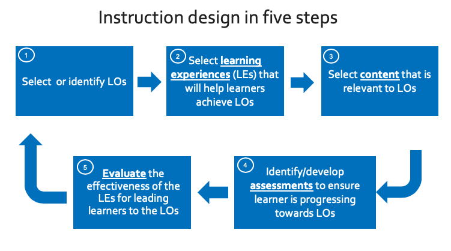
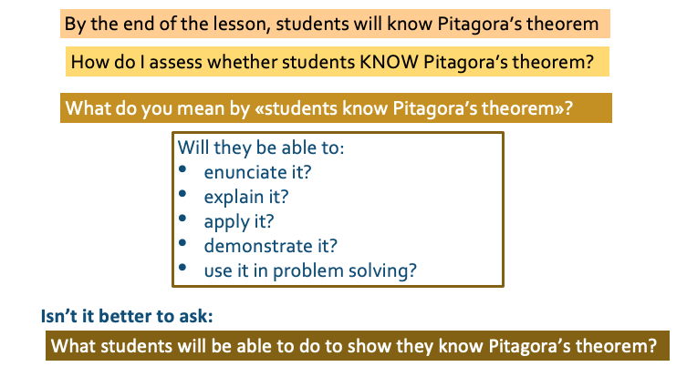
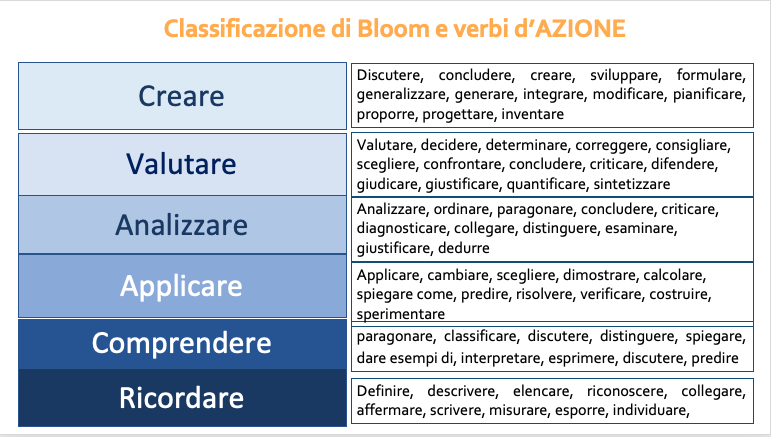

# Assessment and feedback in teaching and training

> Allegra Via
> Institute of Molecular Biology and Pathology
> The National Research Council of Italy

## Teaching objective
Develop an understanding of different types of tools for formative assessment, when to give and receive feedback, and for which purpose

## Learning outcomes
- Explain the importance of formative assessment in the context of instruction design
- List and describe a few techniques for formative assessment

# Part I: Assessment in the context of instructional design 
> Learning Outcomes, Learning Experiences, Content, Assessment, Evaluation

### What is a Learning Outcome (LO)?

LOs (more accurately “desired LOs”) are statements of what you might (in principle) assess. 

You may not end up assessing all of them, but they are statements of what a successful* student will know or be able to do at the end of instruction

### LOs schould be SMART:

**S**pecific
**M**easurable
**A**chievable
**R**ealistic
**T**ime-bound

### How do I write Learning Outcomes?

By the end of the lesson (session/course/instruction) the successful learner will be able to......... 

### Writing Learning Outcomes using assessable verbs

1. Think about what learners will be able to do by the end of instruction
2. Use the sentence: 
3. By the end of the lesson (session/course/instruction) the successful learner will be able to......... 
4. Replace dots with a verb that you can assess (name, explain, solve, distinguish, etc.).
5. Avoid verbs that are open to many interpretations: e.g., appreciate, have faith in, know, learn, understand, believe

> ### Exercise 1 (8 min) - How do I write LOs?

> - Think of a lesson/session you usually deliver 
> - Write one or more Learning Outcomes for the lesson/session
> - Write to the GDoc the title of the lesson/session and the corresponding LO(s)

# Part II: Formative assessment and how to do it

Q: what are the different ways we can categorise assessment?

### Assessment timeline - when and why to assess

- **Pre-course assessment** (before the course) - verify the target audience of the course
- **Preventive assessment** (beginning of the course) - final adjustments of the course to the reality of the participants
- **Formative assessment** (during the course) - pilot in real time if learning is taking place
- **Summative assessment** (right after the course) - measure and evaluate the knowledge and skills acquired
- **Strategic evaluation** (after the course, long time after the course) - measure the adequacy, quality and impact of the course

> ### Exercise 2 (8 minutes): Diagnostic Assessment

> - Propose some questions that could be used in a diagnostic questionnaire to assess whether the students have the prior knowledge needed to follow your lesson
> - Write them in the Google Doc

### Formative assessment

- takes place during teaching and learning. Its purpose is to help both instructors and learners to become aware of what the focus should be.
- its purpose is to improve the quality of student learning, not to provide evidence for evaluating or grading students.
- can be used to collect information about learners':
    - prior knowledge -> which knowledge gaps need to be filled before moving on
    - mental models -> whether their mental models are correct
    - goals and objectives -> if learners goals and objectives are aligned to the course's goals and outcomes
    - frequent mistakes -> which types of mistakes need special attention

### Formative assessment can be done in many different ways:

- Asking questions to learners and getting responses orally;
- Asking them to describe the strategy they would adopt to solve a problem;
- Asking them to solve a problem in groups, or individually but in front of the class;
- Using brainstorming and discussions;
- Providing diagnostic questionnaires;

